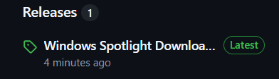
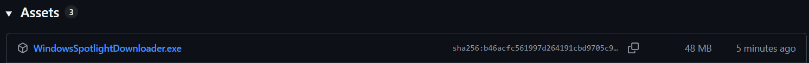
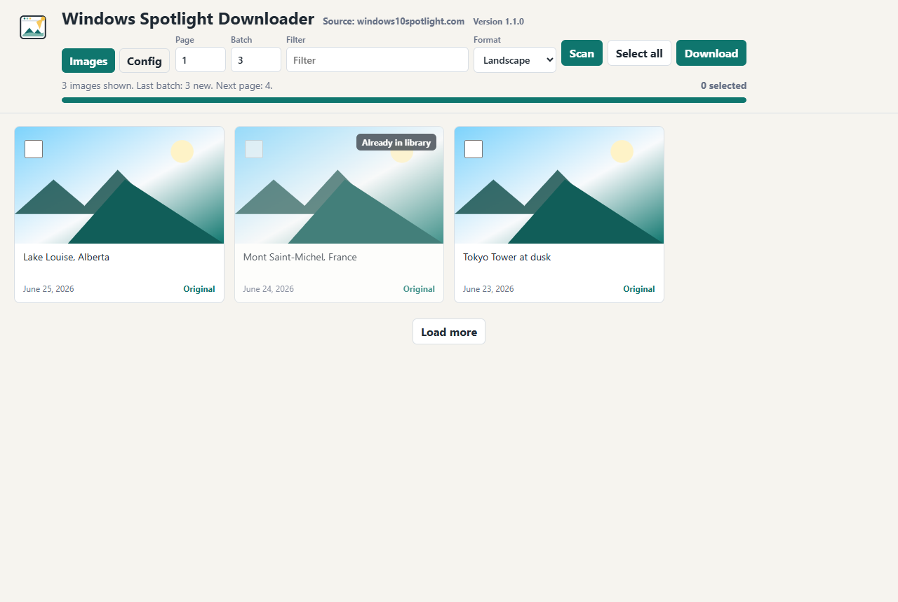
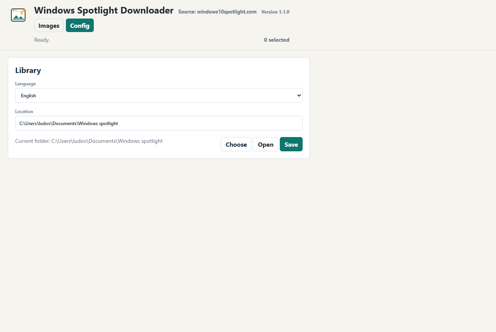

# Windows Spotlight Downloader

[](https://github.com/warnerbross1128/windows-spotlight-downloader/actions/workflows/tests.yml)

[Français](README.fr.md)

<p align="center">
  
</p>

A small local app to browse, select, and download images from `windows10spotlight.com` in original quality.

Image source: [windows10spotlight.com](https://windows10spotlight.com/)

Current version: `1.1.0`

## Features

- Browse Windows Spotlight images from `windows10spotlight.com`.
- Preview images before downloading them.
- Select only the images you want.
- Download landscape, portrait, or both versions when available.
- Choose the library folder.
- Choose the interface language: English or French.
- Detect images already present in the library to avoid duplicates.
- Automatically check whether a newer GitHub release is available.

## Installation

Download the portable release from GitHub Releases, then run `WindowsSpotlightDownloader.exe`.

1. Click the `Releases` button in the GitHub repository.

   

2. In the latest release, download [WindowsSpotlightDownloader.exe](https://github.com/warnerbross1128/windows-spotlight-downloader/releases/download/v1.1.0/WindowsSpotlightDownloader.exe).

   

## Verify The Download

The SHA256 hash for `WindowsSpotlightDownloader.exe` version `1.1.0` is:

```text
45F6D14AE9E08476D7DBCE2AF0634E2D4BFE3EDB6BA74010AF7D1A3340230BE4
```

To verify the downloaded file with PowerShell:

```powershell
Get-FileHash -Algorithm SHA256 .\WindowsSpotlightDownloader.exe
```

The displayed hash must exactly match the value above.

## Windows SmartScreen

Windows may show a SmartScreen warning because the application is not digitally signed yet. This is common for small independent executables that have not built a reputation with Microsoft.

The source code is public, and the SHA256 checksum above lets you verify that the downloaded file matches the published release.

## Screenshots

### Browse Images



### Configure The Library



## Run

Portable version: double-click `WindowsSpotlightDownloader.exe`.

Source version: double-click `Lancer le telechargeur.bat`.

A Windows window opens with the application interface. Selected files are saved to `Images telechargees` by default.

Since `0.2.0`, the application uses PyWebView: closing the window also closes the process.

Since `0.2.2`, only one application instance can be open at a time, which avoids testing against an older copy that is still running.

## From Source

```powershell
python -m pip install -r requirements.txt
python spotlight_downloader.py
```

Run the tests with:

```powershell
python -m unittest discover -s tests
```

## Configure The Library And Language

Open the `Config` tab, choose or type the library folder, select the language, then click `Save`.

Future downloads are saved in that folder. The configuration is stored in `config.json`.

## Updates

On startup, the app checks the latest public GitHub release. If a newer version exists, a notification appears with a direct link to download the new executable.

To publish an update, increment the version in `spotlight_downloader.py`, create a new GitHub release, then attach `WindowsSpotlightDownloader.exe`.

To build the executable from source, see [BUILD.md](BUILD.md).

## License And Legal Notice

The source code of this application is released under the MIT license. See [LICENSE](LICENSE).

Windows Spotlight images are not included in this license and belong to their respective owners. This project is not affiliated with Microsoft or [windows10spotlight.com](https://windows10spotlight.com/).

The application is only a browsing and download tool for the source website, for personal use.

## Project

- Build and release: [BUILD.md](BUILD.md)
- Contributions: [CONTRIBUTING.md](CONTRIBUTING.md)
- Security: [SECURITY.md](SECURITY.md)

## Notes

- WordPress thumbnails such as `image-1024x576.jpg` are converted to the original URL `image.jpg`.
- The `Original` button opens the final image in a new tab.
- The `Format` menu can download landscape, portrait, or both versions when the site provides multiple orientations.
- Images already present in the library are marked in the grid and skipped during download, including variants such as `-2`, `-3`, and so on.
- Scanning and downloading show a progress bar.
- Loading is done in batches. `Scan` restarts from the start page, and `Load more` appends the next batch without clearing images already shown.
- Each batch is limited to 20 pages to avoid hammering the source website.
