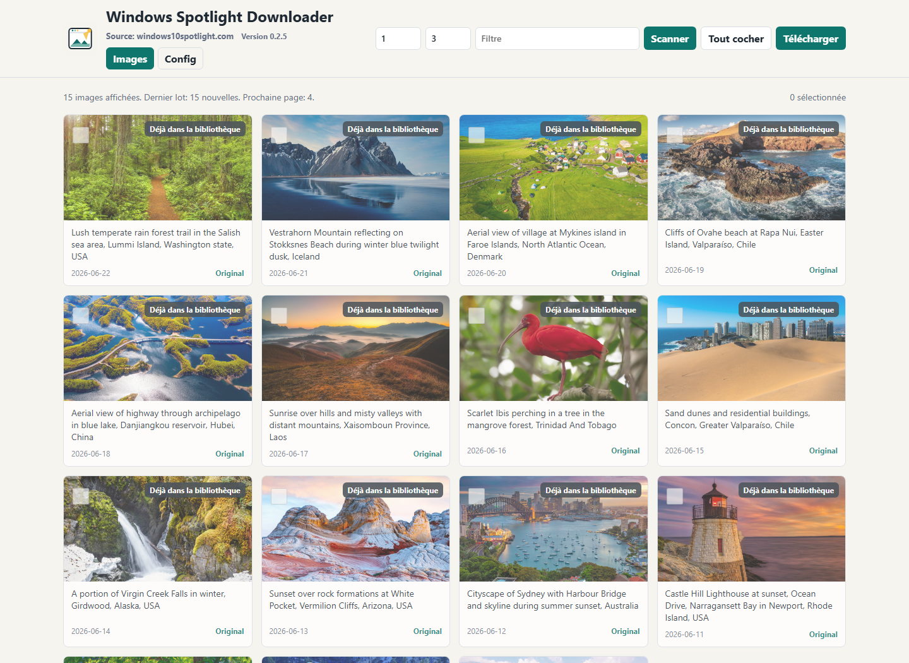
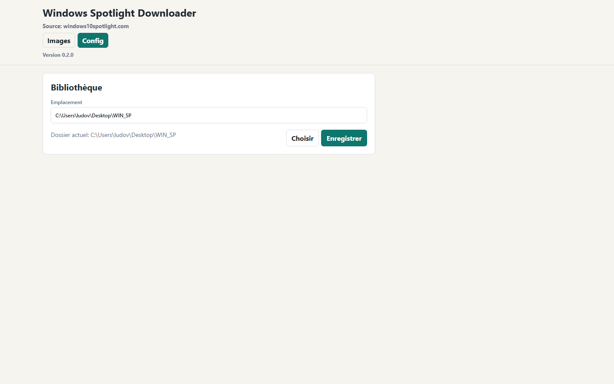

# Windows Spotlight Downloader

[](https://github.com/warnerbross1128/windows-spotlight-downloader/actions/workflows/tests.yml)

<p align="center">
  
</p>

Petit logiciel local pour parcourir, choisir et télécharger les images de `windows10spotlight.com` en qualité originale.

Source des images : [windows10spotlight.com](https://windows10spotlight.com/)

Version actuelle : `1.0.0`

## Fonctionnalités

- Parcourir les images Windows Spotlight depuis `windows10spotlight.com`.
- Voir les images avant de les télécharger.
- Sélectionner uniquement les images voulues.
- Télécharger la version paysage, portrait ou les deux quand elles existent.
- Choisir le dossier de bibliothèque.
- Détecter les images déjà présentes pour éviter les doublons.
- Vérifier automatiquement si une nouvelle release GitHub est disponible.

## Installation

Télécharger la version portable depuis la page des releases GitHub, puis lancer `WindowsSpotlightDownloader.exe`.

1. Cliquer sur le bouton `Releases` du dépôt GitHub.

   

2. Dans la dernière release, télécharger [WindowsSpotlightDownloader.exe](https://github.com/warnerbross1128/windows-spotlight-downloader/releases/download/v1.0.0/WindowsSpotlightDownloader.exe).

   

## Vérifier le téléchargement

Le SHA256 de `WindowsSpotlightDownloader.exe` pour la version `1.0.0` est :

```text
9E546159E24969928F98BC05D6E36FE62F4FD0970A6598F537EBFE1E088DB8DC
```

Pour vérifier le fichier téléchargé avec PowerShell :

```powershell
Get-FileHash -Algorithm SHA256 .\WindowsSpotlightDownloader.exe
```

Le hash affiché doit correspondre exactement à celui indiqué ci-dessus.

## Windows SmartScreen

Windows peut afficher un avertissement SmartScreen parce que l'application n'est pas encore signée numériquement. C'est courant pour les petits exécutables indépendants qui n'ont pas encore de réputation auprès de Microsoft.

Le code source est public, et le checksum SHA256 ci-dessus permet de vérifier que le fichier téléchargé correspond bien à la release publiée.

## Screenshots

### Parcourir les images



### Configurer la bibliothèque



## Lancer

Version portable : double-cliquer sur `WindowsSpotlightDownloader.exe`.

Version source : double-cliquer sur `Lancer le telechargeur.bat`.

Une fenêtre Windows s'ouvre avec l'interface de l'application. Les fichiers sélectionnés sont enregistrés dans `Images telechargees`.

Depuis `0.2.0`, l'application utilise PyWebView : fermer la fenêtre ferme aussi le processus.

Depuis `0.2.2`, une seule instance de l'application peut être ouverte à la fois pour éviter les tests avec une ancienne copie encore active.

## Depuis le code source

```powershell
python -m pip install -r requirements.txt
python spotlight_downloader.py
```

Les tests peuvent être lancés avec :

```powershell
python -m unittest discover -s tests
```

## Configurer la bibliothèque

Ouvrir l'onglet `Config`, choisir ou saisir le dossier de bibliothèque, puis cliquer sur `Enregistrer`.

Les prochains téléchargements seront enregistrés dans ce dossier. La configuration est gardée dans `config.json`.

## Mises à jour

Au démarrage, l'application vérifie la dernière release GitHub publique. Si une version plus récente existe, une notification apparaît avec un lien direct pour télécharger le nouvel exécutable.

Pour publier une mise à jour, incrémenter la version dans `spotlight_downloader.py`, créer une nouvelle release GitHub, puis joindre `WindowsSpotlightDownloader.exe`.

Pour générer l'exécutable depuis le code source, voir [BUILD.md](BUILD.md).

## Licence et avis légal

Le code source de cette application est publié sous licence MIT. Voir le fichier [LICENSE](LICENSE).

Les images Windows Spotlight ne sont pas incluses dans cette licence et appartiennent à leurs détenteurs respectifs. Ce projet n'est pas affilié à Microsoft ni à [windows10spotlight.com](https://windows10spotlight.com/).

L'application sert uniquement d'outil de navigation et de téléchargement depuis le site source, pour usage personnel.

## Projet

- Build et release : [BUILD.md](BUILD.md)
- Contributions : [CONTRIBUTING.md](CONTRIBUTING.md)
- Sécurité : [SECURITY.md](SECURITY.md)

## Notes

- Les vignettes WordPress comme `image-1024x576.jpg` sont converties vers l'URL originale `image.jpg`.
- Le bouton `Original` ouvre l'image finale dans un nouvel onglet.
- Le menu `Format` permet de télécharger la version paysage, portrait ou les deux quand le site propose plusieurs orientations.
- Les images déjà présentes dans la bibliothèque sont signalées dans la grille et ignorées au téléchargement, y compris les variantes `-2`, `-3`, etc.
- Le scan et le téléchargement affichent une barre de progression.
- Le chargement se fait par lots. `Scanner` repart depuis la page de début, et `Charger plus` ajoute le lot suivant sans effacer les images déjà affichées.
- Chaque lot est limité à 20 pages pour éviter de marteler le site.
